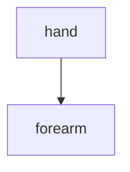

Detectors must detect in the correct order to ensure prerequisite landmarks exist when fetched by subsequent detection models, a map of detection prerequisition is illustrated below:

```mermaid
flowchart TD
    hand --> forearm
```